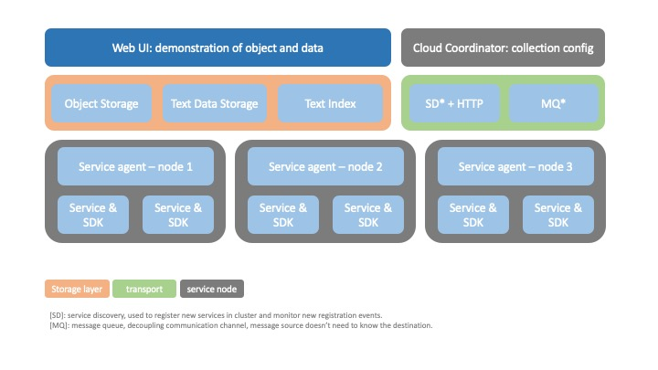

# Data Collection System
## Introduction
This system aims at providing a common service which allows user to collect data from production environment. This allows users to quickly identify issues of the existing models caused by unexpected production environment. For example a face recognition service in production env might be affected by light, and a signal prediction system might be affected by noise. A data collection at production end can efficiently and automatically collect useful data for retrain.

In addition, the data collection system does not conflict with iterative training but collaborate with it to provide faster iteration and issue identification.
## Design

In the architecture design, the system is divided to five sections. Each section performs one aspect of data collection logic.
### Service Layer
Service layer contains service nodes, the business logic should be in the service layer. For example a face recognition system, an OCR system, etc. In each service node, a physical machine or logically separated machine, there should be a service agent in each node, to handle the service configuration, discovery and data buffering. This refers to the sidecar model in Service Mesh. In a real system, data collection system should be able to reuse the existing registry, config center message queue, etc. However, for exploration and learning, this project will try to select one of those existing tools and explore the usage of each one of them.

One thing need to clarify is the separation between service SDK and service agent. The main purpose is to make service SDK as light as possible, may be just an interface to interconnect with service agent. In this way, a user can define SDK of their own choice without caring too many details about service agent implementation. In the service agent, it will be developed in Golang and handle the logic of communicating with the cloud. A good example is once receiving the new config, service agent should restart or hot reload, while not affecting service itself. 

There will other requirements in data collection for sure, and those requirements should be satisfied by the service agent rather than service SDK.
### Transport Layer
Transport layer mainly manage the channel of configuration management. For example, which is the confidence threshold of data collection and which session (a set of images) should be collected under what condition (for example error number > 10).

There are two transport mechanism I intended to use. One is through one to one connection between each service node and cloud and using service discovery components like Consul to create new connections.The other approach is through message queue such as MQTT.
#### SD+HTTP/RPC
This approach will be suitable for less than 100 service node connections. Since cloud service can still handle these connections and send them the configurations (or other commands). This mode is easy and doesn't have to introduce a heavy component to help with the communication. However, it's not scalable. In a city camera monitoring service, there might be 10k+ service nodes then sending data using TCP/HTTP connection is not possible.
#### MQ
This approach comes to save the scenario with heavy loaded clients. If we are okay to experience some delay in receiving requests or commands, message queue can be a good solution to handle the massive connection problem. 

In addition, it also handles thrust request quite well. In our system, service agent needs to occasionally send notifications to the cloud of the data been collected. When in a certain moment there comes high concurrency requests, message queue acts as a buffer to store the sudden requests and cloud server can serve each of them within its capability.
### Storage Layer
In this system design, I use storage layer for all the data being permanently collected. Once in a while,service agent will collect local (buffered) objects and supplement descriptive data and send to the storage layer. Then service agent send a notification to the cloud. In this model, communication between nodes and the cloud is light with only configuration data and event notifications, hence, the availability and performance issues can be handled by maturely designed storage layer components. There can be three types of storage in the system, name it, object storage, descriptive data storage, and text index.
#### Object Storage
This is the place to store object data, such as image and video. The criteria are the data redundancy and data duration, and it is expected to be solved by maturely designed Object Storage. For simplicity, I will choose an easy to use and famous new component MiniO.
#### Data Storage
Data storage will store all the data except the object data, and should contain the url to find that object data. Descriptive data, errors, monitoring status, process results could be stored in this data storage. Since there will not be a static schema for these data types. NoSQL, document data storage should be used. MongoDB is a good choice.
#### Text Index
Same as log data, when the collected data are too large to read and index, it makes sense to add a search engine for the descriptive data. For example if I want to find all recognition error with error message like "uncategorized image", with a text index like ElasticSearch, this can be easily done.
### The Cloud
I've mention the cloud for so many times, and this cloud can be seen as a configuration center, a permanent data record center, a center service that can be used to check service nodes' healthiness, etc. The main interaction on the cloud will be between the cloud and the service agents, where the cloud send down the declaration configuration, and the service agent send back permanent storage notification once in a while.

To give an example of the usage of those notifications, the cloud can set up webhook to some services like Telegram to notify or alert the users.
### Web UI
Lastly is the web UI, which is a demonstration of the integrated data (image + descriptive data). The Web UI can also integrate dynamic filters, for example, filter those stored data with XXX label, filter those with a search text 'ALERT', etc.

There is a hidden section in the system design, the web service layer, which can be public, to provide public APIs to other services about the data collection status and the details about the data being collected. In this system design, the Web UI are the only client for the web service.
