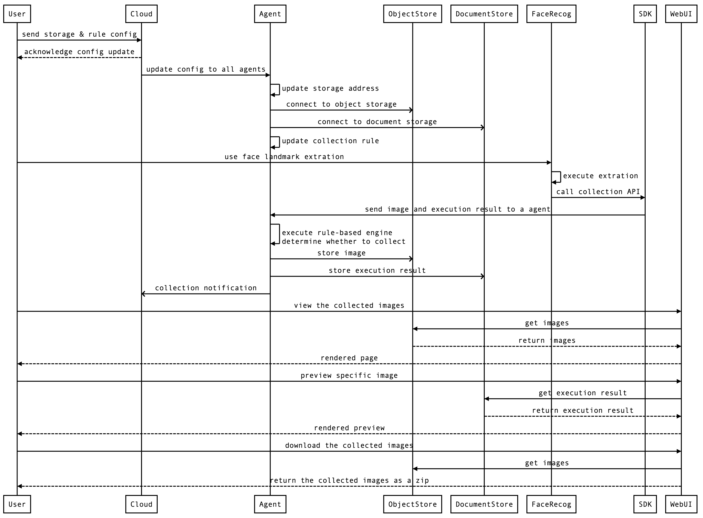

# time sequence diagram

```
// execute on http://www.fly63.com/tool/drawsvg/
User->Cloud: send storage & rule config
Cloud-->User: acknowledge config update
Cloud->Agent: update config to all agents
Agent->Agent: update storage address
Agent->>ObjectStore: connect to object storage
Agent->>DocumentStore: connect to document storage
Agent->Agent: update collection rule

User->AIService: face landmark extration
AIService->AIService: execute extration
AIService->SDK: call collection API
AIService-->User: return exec result
SDK->Agent: send image and result\n to a local agent
Agent->Agent: execute rule-based engine\ndetermine whether to collect
Agent->>ObjectStore: store image
Agent->>DocumentStore: store execution result
Agent->>Cloud: collection notification

User->WebUI: view the collected images
WebUI->ObjectStore: get images
ObjectStore-->WebUI: return images
WebUI-->User: rendered page
User->WebUI: preview specific image
WebUI->DocumentStore: get execution result
DocumentStore-->WebUI: return execution result
WebUI-->User: rendered preview

User->WebUI: download the collected images
WebUI->ObjectStore: get images
ObjectStore-->WebUI: return images
WebUI-->User: return a zip of the images
```

